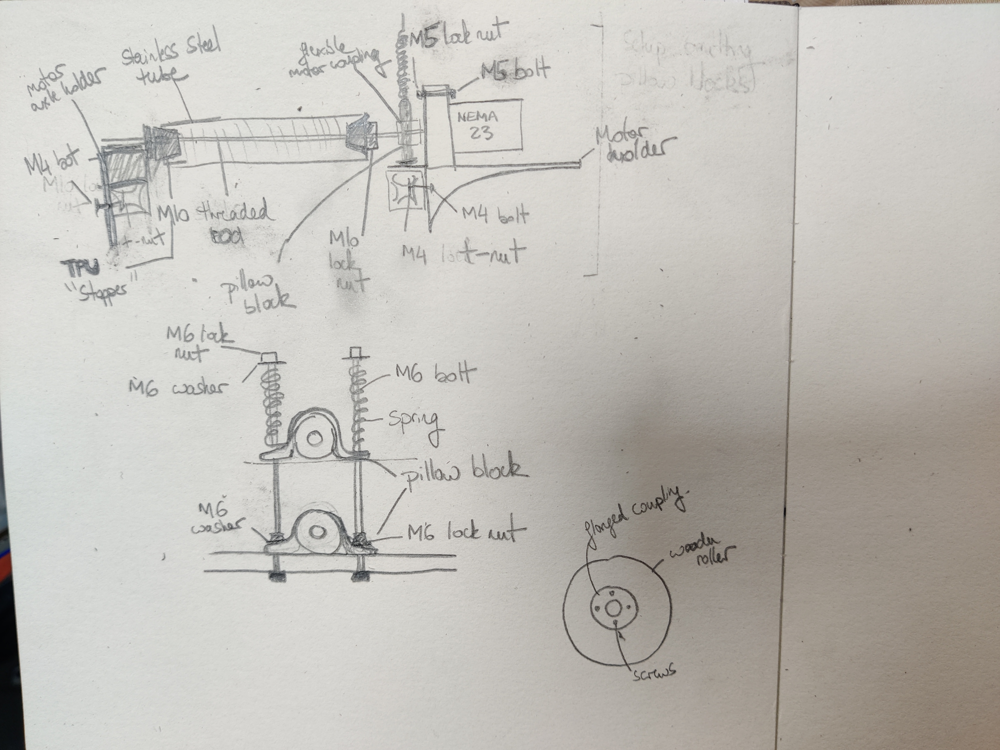

# flax-spinner
Fantasy Fibre Mill's Flax Spinning Machine

## Materials

These are the materials necessary for building the machine.

### Hardware

For the frame:

* 3 x Aluminium Extrusion bars (30 * 60 * 1300mm)
* Aluminium extrusion bars (30 * 30mm) - 2 meters
* M4 T-nuts
* M6 T-nuts
* Angle brackets (that can be placed along as well as across the bars)
* M4 nuts and bolts and washers
* M3 nuts and bolts and washers
* M8 lock nuts

For the gill box:

* 4 x MOD 1.5 50 tooth spur gears ([technobots](https://www.technobotsonline.com/tbot-steel-spur-gear-mod-1.5-50-tooth-ss15-50b.html)). Order with 15mm bore and tapped grub screw holes (pair of M6).
* 4 x 15mm diameter steel round bar, 420mm ([metals4u](https://www.metals4u.co.uk/materials/stainless-steel/stainless-steel-round/1151-p))
* 4 * 15mm diameter steel round bar, 200mm
* 1 x 15mm diameter steel round bar, 250mm
* 2 x 10mm diameter steel round bar, 150mm
* 32 x 2.5mm diameter steel round bar, 100mm
* 2 x 2.5mm diamter steel round bar, 150mm
* 2 x 2 bolt flanged bearings, 10mm bore
* 2 x 2 bolt flanged bearings, 15mm bore
* 2 x 10mm bore flanged shaft coupling
* 1 x 10mm to 15mm rigid shaft coupling
* 2 x 8mm to 15mm rigid shaft coupling (this is for stepper motors with 8mm shaft)
* 12 x ball bearing, 15 x 32 x 9 (ID, OD, W)
* 4 x M15 shaft collar
* 2 part epoxy glue
* Assorted M8 bolts with washers
* M8 lock nuts
* M6 T-nuts
* Assorted M6 bolts with washers

For the rollers:
* 2 x hardwood rollers (80mm diameter, 300mm length)
* 1 x hardwood roller (80mm diameter 115mm length)
* 4 x NEMA 23 stepper motor (M8 shaft if possible)
* M4 T-nuts
* M4 bolts
* 12 x KP000 pillow block bearing, 10mm bore
* 12 x M6 120mm bolt
* 12 x M6 washers
* M5 bolts and lock nuts
* M6 lock nut
* M10 lock nut
* 2 x M10 threaded rod 450mm
* 1 x M10 threaded rod 250mm
* 2 x M10 steel rod 450mm
* 1 x M10 steel rod 250mm
* 2 x stainless steel tube 30mm OD, 1.5mm wall thickness, 300mm length
* 1 x stainless steel tube 30mm OD, 1.5mm wall thickness, 120mm length
* 12 x compression spring, 45mm x 9.6mm, 10.4N/mm (or similar, must fit over M6 bolt)
* 6 x M10 flange coupling connector
* Small wood screws
* Flexible shaft coupling, M10 to motor shaft size (motor with M8 shaft is good)

Electronics:
* Arduino Mega
* 4 x TB6600 stepper motor drivers
* Barrel jack connector
* 24V power supply
* 24V to 12V buck converter

## Instructions

Assemble the roller holders.

Ensure the TPU stoppers are well wedged into the steel roller and press further by tightening the lock nuts. The M10 steel shaft goes through the wooden roller, the fit might be quite tight, you may need to hammer it through.

## License

All source files in this repository are covered by the CERN-OHL-S v2 (even where not explicitly stated). Assume the following license statement applies:

> Copyright Fantasy Fibre Mill 2024.
> This source describes Open Hardware and is licensed under the CERN-
> OHL-S v2.
> You may redistribute and modify this source and make products using it
> under the terms of the CERN-OHL-S v2
> (https://ohwr.org/cern ohl s v2.txt).
> This source is distributed WITHOUT ANY EXPRESS OR IMPLIED
> WARRANTY, INCLUDING OF MERCHANTABILITY, SATISFACTORY
> QUALITY AND FITNESS FOR A PARTICULAR PURPOSE. Please see
> the CERN-OHL-S v2 for applicable conditions.

> As per CERN-OHL-S v2 section 4, should You produce hardware based
> on this source, You must where practicable maintain the Source Location
> visible on the external case of the Textile Machine or other products you make using
> this source.
